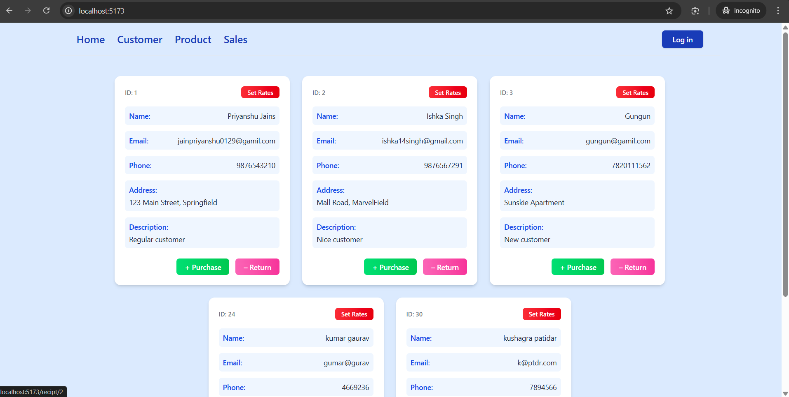
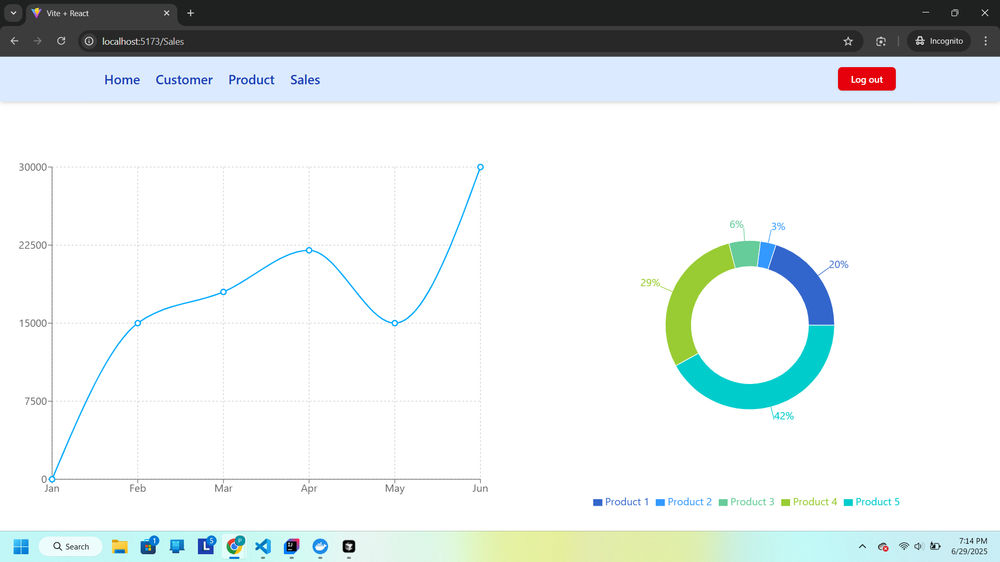
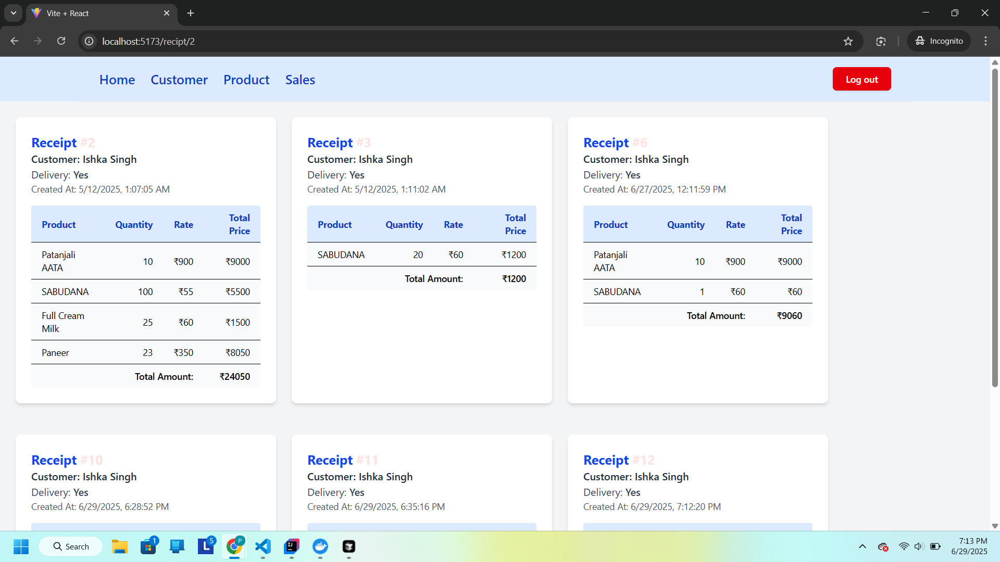
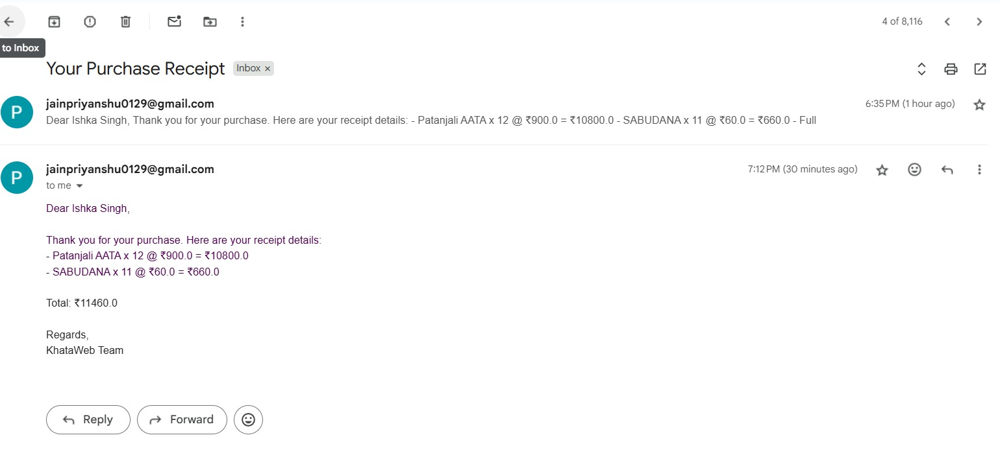

🧾 KhataWeb – B2B Retail Management Platform
Modern business solution for retailers and distributors to manage customer pricing, digital receipts, and sales analytics.

📽️ Demo
📺 [Watch the full demo here](https://drive.google.com/file/d/1GVL3HYnqBB4093LwK8CErW2r5FE_6zB8/view?usp=sharing)

🎯 About
KhataWeb digitizes traditional B2B retail operations, built from real-world wholesale business needs. This platform eliminates manual processes with automated customer-specific pricing, digital receipt generation, and comprehensive sales analytics.

🛠️ Tech Stack
Backend: Spring Boot 3.x, MySQL, Redis, Kafka
Frontend: React + TailwindCSS
Deployment: Docker Compose
Testing: JUnit, Mockito, Spring Boot Test
✨ Key Features

🔐 Role-Based Access Control
 * Owner dashboard with full pricing control
 * Employee portal for receipt generation
 * JWT authentication with secure permissions
   
💰 Dynamic Pricing Engine
 * Customer-specific rate management
 * Bulk pricing and volume discounts
 * Real-time profit margin tracking
   
🧾 Digital Receipt System
 * Professional receipt generation
 * Email notifications via Kafka
 * Delivery status tracking
   
⚡ Performance & Analytics
 * Redis caching for 10x faster access
 * Interactive sales dashboard with charts
 * Real-time inventory management
 * Monthly sales trends and insights

## 🖼️ Screenshots
### 📊 Sales Dashboard (React)

### 🧾 Receipt List View

### 🧑 Customer notification's

🧪 Testing
 * Unit Tests: 90%+ coverage with JUnit 5 and Mockito
 * Integration Tests: Spring Boot Test for API endpoints
 * User Testing: Beta tested with real wholesale businesses
📈 Performance
 * Response Time: <200ms average API response
 * Concurrent Users: 500+ tested capacity
 * Cache Hit Rate: 85%+ Redis efficiency
 * Database: Optimized queries with indexing

# Clone repository
git clone https://github.com/ishkasingh/Khata-web.git 

⭐ Star this repo if you find it helpful!

